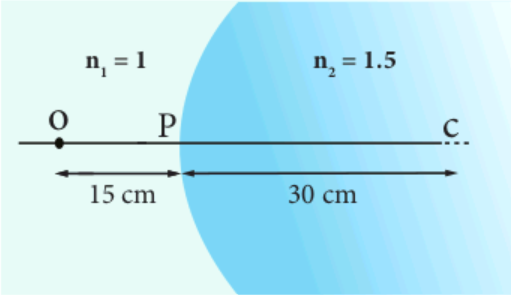

## REFRACTION AT SINGLE SPHERICAL SURFACE

We have so far studied only the refraction at plane surface. The refraction can also take place at spherical surface between two transparent media. The laws of refraction hold good at every point on the spherical surface. The normal at the point of incidence is perpendicular drawn to the tangent plane of the spherical surface at that point. Therefore, the normal always passes through its center of curvature. The study of refraction at single spherical surface paves way to the understanding of thin lenses which consist of two refracting surfaces.

The following assumptions are made while considering refraction at spherical surfaces. (i) The incident light is assumed to be

monochromatic (single colour) (ii) The incident light is very close to the

principal axis (paraxial rays). The sign conventions are similar to that

of the spherical mirrors.

### Equation for refraction at single spherical surface

Let us consider two transparent media with refractive indices _n_1 and _n_2 which are separated by a spherical surface as shown in Figure 6.31. Let _C_ be the centre of curvature of the spherical surface. Let a point object _O_ be in the medium _n_1\. The line _OC_ is the principal axis that cuts the spherical surface at the pole P. As the rays considered are paraxial rays, the perpendicular dropped from the point of incidence to the principal axis is very close to the pole (or) passes through the pole itself.

**6.5**
  

**n1**

**O**

**RP**

**u**

**i N**

 

**r**

**I**

**v**

**n2**

**C**

Light from _O_ falls on the refracting surface at _N_. The normal drawn to the refracting surface at the point of incidence passes through the centre of curvature _C_. As _n_2>_n_1, light in the denser medium deviates towards the normal and meets the principal axis at _I_ where the image is formed.

Snell’s law in product form for the refraction at the point _N_ can be written from equation (6.19),

_n i n r_1 2sin sin=

As the angles are small, sine of the angle could be approximated to the angle itself.

_n i n r_1 2= (6.51)

Let the angles be, ∠_NOP_ = _α_, ∠_NCP_ = _β_, ∠_NIP_ = _γ_ From the right angle triangles ∆_NOP_,

∆_NCP_ and ∆_NIP_,

tan ; tan ; tan_a b g_\= = = _PN PO_

_PN PC_

_PN PI_

As these angles are small, tan of the angle could be approximated to the angle itself.

_a b g_\= = = _PN PO_

_PN PC_

_PN PI_

; ; (6.52)

For the triangle, ∆_ONC_,

_i_ = _α + β_ (6.53)  

For the triangle, ∆_INC_,

_β = r + γ_ (or) _r = β – γ_ (6.54)

Substituting for _i_ and _r_ from equations (6.53) and (6.54) in the equation (6.51).

_n n_1 2_a b b g_+( )= −( )

After rearranging,

_n n n n_1 2 2 1_a g b_\+ = −( )

Substituting for _α_, _β_ and _γ_ from equation (6.52),

_n PN PO_

_n PN PI_

_n n PN PC_1 2 2 1



  

 +



  

 = −( )



  

 

Further simplifying by cancelling PN,

_n PO_

_n PI_

_n n PC_

1 2 2 1+ = − (6.55)

Following sign conventions, _PO_ \= –_u_, _PI_ \= +_v_ and _PC_ \= +_R_ in equation (6.58),

_n u_

_n v_

_n n R_

1 2 2 1

− + =

−( )

After rearranging, finally we get,

_n v_

_n u_

_n n R_

2 1 2 1− = −( ) (6.56)

Equation (6.56) gives the relation among the object distance _u_, image distance _v_, refractive indices of the two media (_n_1 and _n_2

) and the radius of curvature _R_ of the spherical surface. It holds good for any spherical surface as sign conventions are applied.

If the first medium is air, then _n_1 = 1 and for the second medium _n_2 = _n_, then the equation is reduced to,

_n v u_

_n R_

− = −( )1 1

(6.57)

**EXAMPLE 6.12**

Locate the image of the point object _O_ in the situation shown. The point _C_ denotes
| Nn1 |n2 |
|------|------|------|------|------|
| ir |
|  | | |
  

the centre of curvature of the separating surface.

15 cm 30 cm

c

**n1 = 1 n2 = 1.5**

o P

**_Solution_** Given, _u_ = –15 cm, _R_ = 30 cm, _n_1 = 1 and _n_2 = 1.5

Equation for single spherical surface is, _n v_

_n u_

_n n R_

2 1 2 1− = −( )

Substituting the values,

1 5 1 15

1 5 1 30

1 5 1 15

0 5 30

. . ; . .

_v v_ − − =

−( ) + =

( )

1 5 1 15

1 60

1 5 1 60

1 15

1 5. ; . ; . _v v v_ \+ = = −

1 60

1 15

1 5 1 4 60

3 60

1 20

; . ; _v_

\= − = − = − =− ; _v_ = –30 cm

The image is a virtual image formed 30 cm to the left of the spherical surface.
