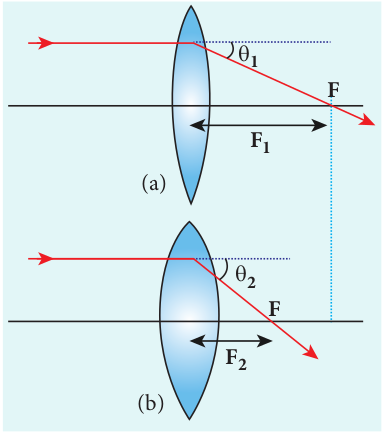
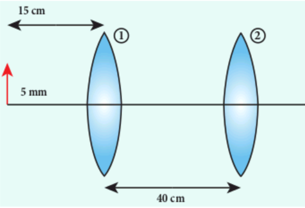
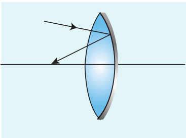
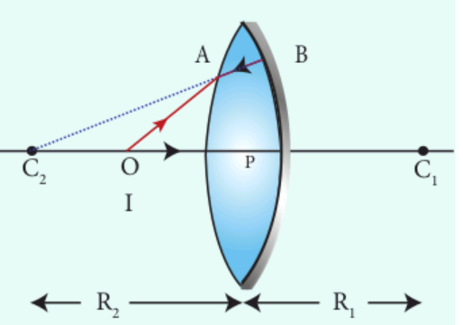

## THIN LENS

A lens is formed by a transparent material bounded between two spherical surfaces (or) one plane and another spherical surface. In a thin lens, the distance between the surfaces is very small. For two spherical surfaces, there will be two centres of curvature _C_1 and _C_2 and correspondingly two radii of curvature _R_1 and _R_2\. For a plane surface, the centre of curvature _C_ is at infinity and

its radius of curvature _R_ is infinity (_R_ = ∞). The terminologies of spherical mirrors hold good very much for thin lenses except for the focal length.

### Primary and secondary focus

As the thin lens is formed by two surfaces, the lens may separate two different media. i.e. the media to the left and right of the lens may be different. Hence, we have two focal lengths.

**The _primary focus F_1 is defined as a point where a point source kept produces a parallel emergent rays to the principal axis after passing through lens** as shown in Figure 6.32. For a converging lens, such an object is a real object and for a diverging lens, it is a virtual object. The distance _PF_1 is the _primary focal length f_1_._

**The _secondary focus_ _F_2 is defined as a point where all the parallel rays travelling close to the principal axis converge to form an image on the principal axis** **after passing through lens** as shown in Figure 6.33. For a converging lens, such an image is a real image and for a diverging lens, it is a virtual image. The distance _PF_2 is the secondary focal length _f_2.

If the media on the two sides of a thin lens have same refractive index, then the two focal lengths are equal. We will mostly be using the secondary focus _F_2 in our further discussions.

### Sign conventions on focal length for lens ###

The sign conventions for thin lenses differ only in the signs followed for focal lengths.

(i) The sign of focal length is _not decided_ on the direction of measurement of the focal length from the pole of the lens as they have two focal lengths, one to the left and another to the right.

(ii) The focal length of the thin lens is taken as positive for a converging lens and negative for a diverging lens.

The other sign conventions for object distance, image distance, radius of curvature, object height and image height (except for the focal lengths as mentioned above) remain the same for thin lenses as that of spherical mirrors.

### Lens maker’s formula and lens equation

Let us consider a thin lens made up of a medium of refractive index _n_2 placed in a medium of refractive index _n_1\. Let _R_1 and _R_2 be the radii of curvature of two spherical surfaces  and  respectively and _P_ be the pole as shown in Figure 6.34. Consider a point object _O_ on the principal axis. A paraxial ray from _O_ which falls very close to _P_, after refraction at the surface  forms image at _I'_. Before it does so, it is again refracted by the surface . Therefore, the final image is formed at _I_.  

The general equation for the refraction at a single spherical surface is given by the equation (6.56) is,

_n v_

_n u_

_n n R_

2 1 2 1− = −( )

For the refracting surface , the light goes from _n_1 to _n_2.

_n v_

_n u_

_n n R_

2 1 2 1

1′ − =

−( ) (6.58)

For the refracting surface , the light goes from medium _n_2 to _n_1.

_n v_

_n v_

_n n R_

1 2 1 2

2

− ′ =

−( ) (6.59)

For surface , _I'_ acts as virtual object. Adding the above two equations (6.58)

and (6.59)

_n v_

_n u_

_n n R R_

1 1 2 1

1 2

1 1 − = −( ) −



 



 

On further simplifying and rearranging,

1 1 1 12 1

1 1 2_v u n n_

_n R R_ − =

−

 



  −



 



 

1 1 1 1 12

1 1 2_v u n n R R_

− = − 

 



  −



 



  (6.60)

O P **I I'**

**n1 n1n2**

**u v**

**v**

**21**

|------|------|------|------|
| 2 |

  

If the object is at infinity, the image is formed at the focus of the lens. Thus, for _u_ = ∞, _v_ = _f_. Then the equation becomes.

1 1 1 1 12

1 1 2_f n n R R_

− ∞ = − 

 



  −



 



 

1 1 1 12

1 1 2_f n n R R_

\= − 

 



  −



 



  (6.61)

If the lens is kept in air, then we can take _n_1 = 1 and _n_2 = _n_. So the equation (6.61) becomes,

1 1 1 1

1 2_f n_

_R R_ \= −( ) −



 



  (6.62)

The above formula is called as the **_lens maker’s formula_**, because it tells the lens manufactures what curvature is needed for a material of particular refractive index to make a lens of desired focal length. This formula holds good also for any type of lens. By comparing the equations (6.60) and (6.61) we can write,

1 1 1 _v u f_ \- = (6.63)

The above equation is known as **_lens equation_** which relates the object distance _u_ and image distance _v_ with the focal length _f_ of the lens. This equation holds good for any type of lens.

### Lateral magnification in thin lens

Let us consider an object _OO'_ of height _h_1 placed on the principal axis with its height perpendicular to the principal axis. The inverted real image _II_ ′ is formed which has a height _h_2 as shown in Figure 6.35.  

**u v Figure 6.35 Lateral magnification in thin** lens

The lateral (or) transverse magnification _m_ is defined as the ratio of the height of the image to height of the object.

_m II OO_

\= ′ ′ (6.64)

From the two similar triangles ∆ _POO_′ and ∆ _PII_ ′ , we can write,

_II OO_

_PI PO_

′ ′ = (6.65)

On applying sign convention, − ′ = −

_h h_

_v u_

Substituting this in the equation (6.65) for magnification,

_m h h_

_v u_

\= − ′ = −

After rearranging,

_m h h_

_v u_

\= ′ = (6.66)

The magnification is negative for real image and positive for virtual image. In the case of a concave lens, the magnification is always positive and less than one.

We can also have the other forms of equations for magnification by combining the lens equation as,

_m h h_

_f f u_

\= ′ = +

(or) _m h h_

_f v f_

\= ′ = − (6.67)

|------|------|------|
| h |IF |
| P |
  

**EXAMPLE 6.13**

A biconvex lens has radii of curvature 20 cm and 15 cm for the two curved sufaces. The refractive index of the material of the lens is 1.5.

(a) What is its focal length?

(b) Will the focal length change if the lens is flipped by the side?

**_Solution_**

For a biconvex lens, radius of curvature of the first surface is positive and that of the second surface is negative as shown in figure.

R2 = cm

**1 2**

C2 C1R1 = 20cm

Given, _n_ = 1.5, _R_1=20 cm and _R_2= –15 cm

(a) Lens maker’s formula, 1 1 1 1

1 2_f n_

_R R_ \= − −



 



 

( )

Substituting the values,

1 1 5 1 1 20

1 15

1 5 1 1 20

1 15_f_

\= − − −



 



 = − +



 



 ( . ) ( . )

1 0 5 1 20

1 15

0 5 3 4 60

1 2

7 60_f_

\= + 

 



 =

+

 



 = × 

 ( . ) ( . )



 =

7 120

_f_ \= = 120

7 17 14. cm

As the focal length is positive the lens is a converging lens.  

(b) When the lens is flipped by the side,

**1 2**

C2 C1

R2 = cm

R1 = 15cm

Now, _n_ = 1.5, _R_1= 15 cm and _R_2= –20 cm

Substituting the values in the lens maker's formula, 1 1 5 1 1

15 1 20_f_

\= − − −



 



 ( . )

1 1 5 1 1 15

1 20_f_

\= − + 

 



 ( . )

This will also result in, _f =_ 17.14 _cm_ Thus, it is concluded that the focal length of the lens will not change if it is flipped by the side. This is true for any lens. Students can verify this for any kind of lens.

**EXAMPLE 6.14** Determine the focal length of the lens made up of a material of refractive index 1.52 as shown in the diagram. (Points _C_1 and _C_2 are the centers of curvature of the first and second surfaces respectively.)

**10 cm**

**20 cm**

**C1 C2**
| 2 |
|------|------|

| R |= cm2 |
|------|------|------|

  

**_Solution_** This lens is called convexo-concave lens

Given, _n_ = 1.52, _R_1= 10 cm and _R_2= 20 cm

Both _R_1 and _R_2 are positive

Lens makers formula, 1 1 1 1

1 2_f n_

_R R_ \= − −



 



 

( )

Substituting the values,

1 1 52 1 1 10

1 20_f_

\= − − 

 



 ( . )

1 0 52 2 1 20

0 52 1 20

0 52 20_f_

\= −

 



 =



  

 =( . ) ( . ) .

_f_ \= = 20

0 52 38 46

. . cm

As the focal length is positive, the lens is a converging lens.

### Power of a lens

The power of a lens is a measure of its deviating ability on an incident light. When a ray is incident on a lens then the degree with which the lens deviates the ray is determined

by the power of the lens. Power of the lens is inversely proportional to the focal length i.e. greater the power of lens, smaller will be the focal length. In Figure 6.36, the lens (b) has greater deviating ability than lens (a). As (b) has greater deviating ability, its focal length is less and vice versa.

In other words, **the _power_ of a lens is a measure of the degree of convergence (or) divergence the lens produces on the light falling on it**. The power of a lens _P_ is the reciprocal of its focal length in meter.

_P f_

\= 1 (6.68)

The unit of power is dioptre (D). 1 D = 1 m–1. Power is positive for converging lens and negative for diverging lens.

From the lens maker's formula, equation (6.62), the equation (6.68) can be written for power as ,

_P f_

_n R R_

\= = − − 

 



 

1 1 1 1

1 2

( ) (6.69)

The outcome of this equation for power is that for a given geomentry of the lens, larger the value of refractive index, greater is the power of lens and vice versa. Also for lenses with small radii of curvature (bulky) the power is large and for lenses with large radii of curvature (skinny), the power is small.

**EXAMPLE 6.15**

If the focal length is 150 cm for a lens, what is the power of the lens?

**_Solution_** Given, focal length, _f_ = 150 cm = 1.5 m

Equation for power of lens is, _P f_

\= 1

Substituting the values,
| F1 |
|------|------|------|------|------|------|

| F(a)1 |
| F2 |

| F2 |
  

_P_ \= = 1

1 5 0 67

. .

m D

As the power is positive, it is a converging lens.

### Focal length of lenses in contact

Let us consider two lenses  and  of focal lengths _f_1 and _f_2 placed coaxially in contact with each other so that they have a common principal axis. For a point object placed at O beyond the focus of the lens  on the principal axis, an image is formed by it at _I'_. This image _I'_ acts as an object for the lens  and the final image is formed at _I_ as shown in Figure. 6.37. As these two lenses are thin, the measurements are done with respect to the common optic centre _P_ between the two lenses.

**Figure. 6.37** Lenses in contact

For the lens _,_ the object distance _PO_ is _u_ and the image distance _PI'_ is _v_′. For the lens , the object distance _PI'_ is _v_′ and the image distance _PI_ is _v_.

Writing the lens equation (6.63) for lens ,

1 1 1

1′ − =

_v u f_ (6.70)

Writing the lens equation (6.63) for lens ,  

1 1 1

2_v v f_ − ′ = (6.71)

Adding the above two equations (6.70) and (6.71) gives,

1 1 1 1

1 2_v u f f_ − = + (6.72)

The combination acts as a single lens of focal length _f_ so that for an object at the position _O,_ it forms the image at _I._ Then,

1 1 1 _v u f_ − = (6.73)

Comparing the equations (6.72) and (6.73) we can write,

1 1 1

1 2_f f f_ \= + (6.74)

The above equation can be extended for any number of lenses in contact as,

1 1 1 1 1

1 2 3 4_f f f f f_ \= + + + + ......... (6.75)

The above equation can be written in terms of power of the lenses as,

_P P P P P_\= + + + +1 2 3 4 ......... (6.76)

Where, _P_ is the net power of the lenses in contact. One should note that the sum in equation (6.76) is an algebraic sum. The powers of individual lenses may be positive (for convex lenses) and negative (for concave lenses). Combination of lenses helps to obtain converging (or) diverging lenses of desired magnification. Also, combination of lenses enhances the sharpness of the image. As the image formed by the first lens becomes the object for the second and so on, the total magnification _m_ of the combination is the a product of magnification of individual lenses. We can now write,

_m_ = _m_1 × _m_2 × _m_3 . . . . . (6.77)

|------|------|------|------|------|------|

  

Where _m_1, _m_2, _m_3 . . . . . are magnification of individual lenses.

**EXAMPLE 6.16**

What is the focal length of the combination if the lenses of focal lengths –70 cm and 150 cm are in contact? What is the power of the combination?

**_Solution_** Given, focal length of first lens, _f_1 = –70 cm, focal length of second lens, _f_2 = 150 cm. Equation for focal length of lenses in

contact, 1 1 1

1 2_f f f_ \= +

Substituting the values, 1 1

70 1

150 1

70 1

150_f_ \= − + =− +

1 150 70 70 150

80 70 150

80 10500_f_

\= − + ×

\= − ×

\=−

_f_ \=− =− 1050 8

131 25. cm

As the final focal length is negative, the combination of two lenses is a diverging system of lenses.

The power of the combination is,

_P f_

\= = −

\=− 1 1

1 3125 0 76

. .

m D

**Points to Ponder**  
System of combination of lenses is
commonly used in designing lenses
for cameras, microscopes, telescopes
and other optical instruments. They
produce better magnification and
sharpness of the image.

**EXAMPLE 6.17**
An object of 5 mm height is placed at a distance of 15 cm from a convex lens of focal length 10 cm. A second lens of focal length 5 cm is placed 40 cm from the first lens and 55 cm from the object. Find (a) the position of the final image, (b) its nature and (c) its size.

**_Solution_** Given, _h_ = 5 mm = 0.5 cm, _u_1 = –15 cm, _f_1 = 10 cm, _f_2 = 5 cm, _d_ = 40 cm

For the first lens, the lens equation is, 1 1 1

1 1 1_v u f_ − =

Substituting the values,

System of combination of lenses is commonly used in designing lenses for cameras, microscopes, telescopes and other optical instruments. They produce better magnification and sharpness of the image.
  

1 1 15

1 10

1 1 15

1 101 1_v v_

− − = + =;

1 1 10

1 15

15 10 150

5 150

1 301_v_

\= − = −

\= =

_v_1= 30 cm

First lens forms image 30 cm to the right of the first lens. Let us find the height of this image.

Equation for magnification is, _m h h_

_v u_

\= ′ = 1

1

Substituting the values, ′ = −

_h_ 0 5

30 15.

′ = × − =−_h_ 0 5 30

15 1. cm

As the height of the image is negative, the image is inverted and real.

This image acts as object for second lens. The object distance for second lenses, (40–30=10 cm). Hence, _u_2 = –10 cm

For the second lens, the lens equation is, 1 1 1

2 2 2_v u f_ − =

Substituting the values, 1 1

10 1 5

1 1 10

1 52 2_v v_

− − = + =;

1 1 5

1 10

10 5 50

5 50

1 102_v_

\= − = − = =

_v_2 10= cm

The final image is formed 10 cm to the right of the second lens.

Let us find the height of the final image. Assume, the final height of the image formed by the second lens is _h''_ and the height of the object for the second lens is _h'_.

Equation for magnification is _m'_ for the

second lens is, ′ = ′′ ′ =_m h_

_h v u_

2

2  

Substituting the values, ′′ − = −

_h_ 1

10 10

′′ = − × −



 



 = =_h_ ( )1 10

10 1 10cm mm

As the height of the image is positive, the image is erect and real.

### Silvered lenses

If one of the surfaces of a lens is silvered from outside, then such a lens is said to be a silvered lens. A silvered lens is a combination of a lens and a mirror. Light can enter through the transparent front surface of the lens and get reflected by the silver coated rear surface. Hence, light travels two times through the lens as shown in Figure 6.38.

The power _P_ of the silvered lens is,

_P = Pl + Pm + Pl_

_P =_ 2_Pl + Pm_ (6.78)

Here, _Pl_ is the power of the lens and _Pm_ is the power of the mirror. We know that the power of a lens is the reciprocal of its focal length. But, the power of a mirror is negative of the reciprocal of its focal length. This is because, a concave mirror which has negative focal length is

|------|------|------|------|------|

  

a converging mirror with positive power. Also, a silvered lens is basically a modified mirror. Thus,

_P f_

_P f_

_P fl_

_l m_

_m_

\= −

\= = −

1 1 1; ; (6.79)

Now equation (6.78) becomes,

1 2 1 −



 



  = 

 



  + −



 



 _f f fl m_

(6.80)

Proper sign conventions are to be followed for equation (6.80).

Suppose the object distance _u_ and image distance _v_ are to be found, we can very well use the mirror equation (6.8), since the silvered lens is a modified mirror.

1 1 1 _v u f_ \+ =

**EXAMPLE 6.18**

A thin biconvex lens is made up of a glass of refractive index 1.5. The two surfaces have equal radii of curvature of 30 cm each. One of its surfaces is made reflecting by silvering it from outside. (a) What is the focal length and power of this silvered lens? (b) Where should an object be placed in front of this lens so that the image is formed on the object itself?

**_Solution_** The given situation is shown in figure.

O I

A B

OO

C2 C1 P

R2 R1

Given, _n_ = 1.5; _R_1 = 30 cm; _R_2 = –30 cm;  

(a) Let us find _f_l and _f_m separately.

Using lens maker’s formula we can find _f_l.

1 1 1 1

1 2_f n_

_R Rl_

\= − − 

 



 

( )

Substituting the values, 1 1 5 1 1 30

1 30_fl_

\= − − −



 



 ( . )

1 0 5 1

30 1 30

1 2

2 30

1 30_fl_

\= + −



 



 = 

  

  

  

 =( . )

cm

_f_l = 30 cm = 0.3 m Focal length of mirror is, _f_

_R m_ \= 2

2

Substituting the values, _fm_ \= − =−

30 2

15cm

_f_m = 15 cm = –0.15 m

Now the focal length of the slivered lens is, 1 2 1 − = +

−_f f fl m_

1 2 30

1 15

2 15

1 7 5−

\= + = = _f_ .

_f_ \= – 7.5 cm = –0.075 m The silvered mirror behaves as a concave mirror with its focal length on left side. To find the power of the silvered lens, _P_ = 2_Pl_ + _Pm_

_P f f_

_D_

_l m_

\= + − −

\= + −

\= + = =

2 1 2 0 3

1 0 15

2 0 3

1 0 15

4 0 3

13 33

. ( . )

. . . .

As the power is positive it is a converging system. \[Note: Here, we come across a silvered lens which has negative focal length and positive power. Which implies that the focal length is to the left and the system is a converging one. Such situations are possible in silvered lenses because a silvered lens is basically a modified mirror.\] (b) Writing the mirror formula, 1 1 1 _f v u_ \= +

Here, both _u_ and _v_ are same (_v = u_) as the image coincides with the object.
| AB |
|------|------|------|------|

  

1 7 5

1 1 2 −

\= + = . cm _u u u_ ; u = –2 × 7.5 cm

_u_ = –15 cm = –0.15 m The object is to be placed 15 cm to the left of the silvered lens.